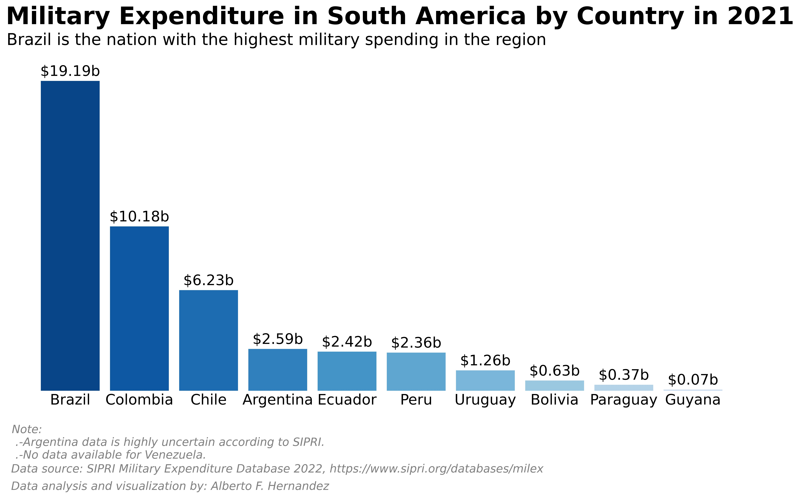

# Military Expenditure in South America by Country in 2021

## Chart

## References

Harris, C., Millman, K., van der Walt, S., Gommers, R., Virtanen, P., & Cournapeau, D. et al. (2022). Array programming with NumPy. Springer Science and Business Media LLC. 

Hunter, J. (2007). Matplotlib: A 2D graphics environment. IEEE COMPUTER SOC. 

Kluyver, T., Ragan-Kelley, B., Perez, F., Granger, B., Bussonnier, M., & Frederic, J. et al. (2016). Jupyter Notebooks - a publishing format for reproducible computational workflows. In Positioning and Power in Academic Publishing: Players, Agents and Agendas (pp. 87-90). Netherlands; IOS Press. Retrieved 19 May 2022, from https://eprints.soton.ac.uk/403913/. 

Stockholm International Peace Research Institute SIPRI. (n.d.). Military Expenditure Database. Retrieved February 9, 2023, from https://www.sipri.org/databases/milex 

The pandas development team. (2020). pandas-dev/pandas: Pandas. Zenodo. 

van Rossum, G. (1991). Python. Python Software Foundation. 

## Author

Alberto F. Hernandez

- [@albertoscode](https://github.com/albertoscode)

## Feedback

If you have any feedback, please write to the following email address: ah8664383@gmail.com

